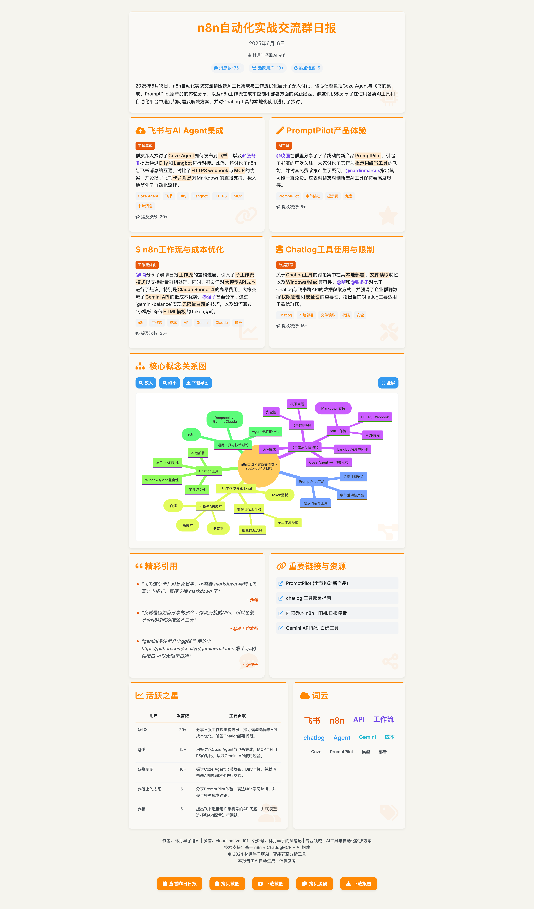

## 💬 微信群聊 AI 日报生成器

**功能**: 自动分析微信群聊记录，生成精美的 HTML 日报页面

**技术栈**: n8n + ChatlogMCP + Google Gemini + EdgeOne Pages

**特性**:
- AI 智能内容分析和话题提取
- 自动生成可视化数据（词云、活跃度统计）
- 响应式 HTML 页面，适配移动端
- 支持多群聊批量处理
- 定时自动执行

**依赖**:
- [Chatlog](https://github.com/sjzar/chatlog) - 微信聊天记录工具
- Google Gemini API
- EdgeOne Pages（可选）

**效果预览**:

[完整教程](https://rvfdqgohv5q.feishu.cn/wiki/IH4Uw4zCVimLbXkk1RKcm8Bvnwf?fromScene=spaceOverview)