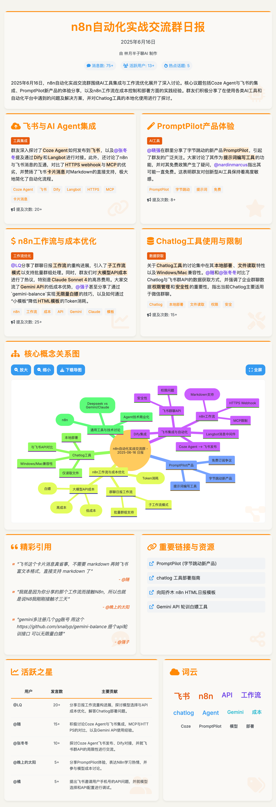

# 💬 微信群聊 AI 日报生成器

> 自动分析微信群聊记录，生成精美的 HTML 日报页面

📖 **[完整教程](https://rvfdqgohv5q.feishu.cn/wiki/IH4Uw4zCVimLbXkk1RKcm8Bvnwf?fromScene=spaceOverview)** | 🎯 **技术栈**: n8n + ChatlogMCP + Google Gemini + EdgeOne Pages

## 🚀 快速开始

### 📦 版本选择

| 版本 | 适用场景 | 特点 | 推荐用户 |
|------|----------|------|----------|
| **多群组版** | 需要处理多个群聊 | 主子架构，支持批量处理 | 企业用户、重度用户 |
| **单群组版** | 只处理一个群聊 | 流程简单，快速上手 | 个人用户、初学者 |
| **成本优化版** | 对成本敏感，需要高频或大规模运行 | **运行成本极低**，采用高性价比模型 | 开发者、预算有限的用户 |

### 📥 工作流文件

- `workflow-multi-group.json` - 智能微信群聊日报生成器 - 多群组版
- `workflow-single-group.json` - 智能微信群聊日报生成器 - 单群组版
- `wechat-daily-digest-ai-cost-optimized.json` - **（新）** 成本优化版工作流配置说明

## ✨ 核心特性

- 🧠 **AI 智能分析**: 自动提取话题和关键信息
- 📊 **数据可视化**: 词云图、活跃度统计
- 📱 **响应式设计**: 完美适配手机和电脑
- ⏰ **定时执行**: 自动生成日报，无需手动操作
- 🔄 **批量处理**: 支持多群聊同时处理（多群组版）

## 🛠 依赖工具

- [Chatlog](https://github.com/sjzar/chatlog) - 微信聊天记录工具
- Google Gemini API
- EdgeOne Pages（可选）

## 🎬 效果预览

## 📚 详细教程

完整的安装配置教程请查看：[📖 完整教程文档](https://mp.weixin.qq.com/s/D7gTIGqIP48oi9X55ZtSeg)